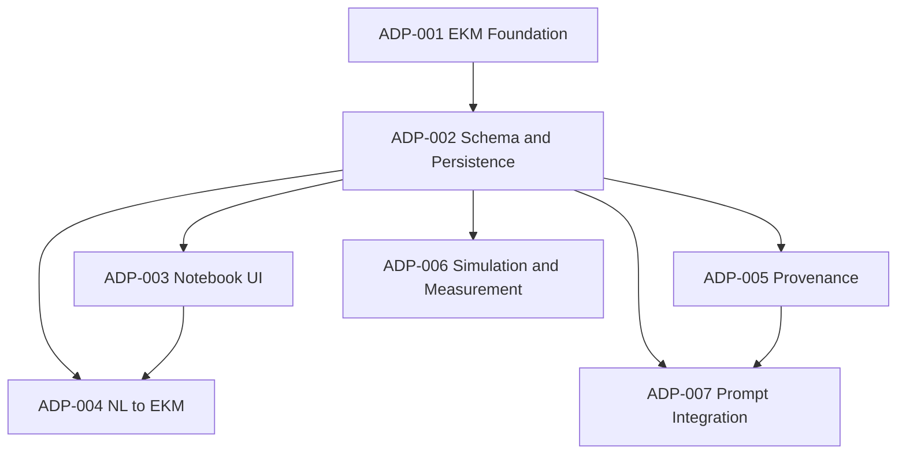

# ADP-001: Engineering Knowledge Model (EKM) Foundation

[Home](../../README.md) › [Project Index](../../PROJECT_INDEX.md) › [Architecture](README.md) › ADP-001

**Status:** Accepted (v1.1 — revised per architecture review)

**Author:** Ed Becnel

**Project:** KiCad AI Integration Plugin

**Version:** 1.1

**Date:** 2026-07-28

**Ratified by:** [ADR-0005](ADRs/ADR-0005-EKM-Foundation.md)

---

## 1. Purpose

This Architectural Design Proposal (ADP) defines the Engineering Knowledge Model (EKM), which will become the canonical representation of engineering knowledge associated with a KiCad project.

The EKM extends the traditional schematic by capturing the engineering rationale behind the design rather than only the electrical connectivity.

This document establishes the architecture only. It does not define the user interface or implementation details.

---

## 2. Background

KiCad schematics describe electrical connectivity.

They do not capture:

- Design objectives
- Design rationale
- Engineering assumptions
- Optimization goals
- Design constraints
- Simulation objectives
- Bench measurements
- AI recommendations
- Engineering decisions

As a result, much of the engineering knowledge remains trapped inside emails, notebooks, conversations, or the designer's memory.

The goal of the Engineering Knowledge Model is to preserve this knowledge as part of the project itself.

---

## 3. Problem Statement

Traditional ECAD tools answer one question:

> **"What is connected?"**

They generally do not answer:

- Why was this component selected?
- What assumptions were made?
- What tradeoffs were considered?
- What behavior is being optimized?
- What measurements validated the design?
- What recommendations has the AI made?
- Which assumptions remain unverified?

Without this information, AI analysis lacks important engineering context.

---

## 4. Goals

The Engineering Knowledge Model shall:

- Preserve engineering intent.
- Preserve engineering assumptions.
- Preserve optimization goals.
- Preserve design constraints.
- Preserve engineering rationale.
- Preserve measurements.
- Preserve simulation results.
- Preserve AI recommendations.
- Preserve design history.
- Become the authoritative engineering knowledge repository for the project.

The EKM shall be independent of any specific engineering discipline.

---

## 5. Non-Goals

The Engineering Knowledge Model is NOT intended to:

- Replace the KiCad schematic.
- Replace SPICE models.
- Replace project documentation.
- Replace requirements management tools.
- Replace issue tracking systems.

Instead, it complements these tools by providing structured engineering knowledge.

---

## 6. Architecture

The Engineering Knowledge Model becomes an additional project artifact.

```
User
   │
   ▼
Engineering Notebook UI
   │
   ▼
View Model
   │
   ▼
Engineering Knowledge Model (Canonical)
   │
   ▼
JSON Persistence
   │
   ▼
AI / Plugin / ngspice
```

The EKM becomes the single source of truth for **engineering knowledge** — intent, rationale, assumptions, and curated decisions. It does not replace KiCad or extracted design snapshots (see §16–18).

---

## 7. Canonical Representation

The Engineering Knowledge Model is represented internally as structured data.

JSON is the storage format.

JSON is NOT the user interface.

Users should never be required to manually edit JSON.

The plugin is responsible for translating between:

- Human-readable notebook
- Internal Engineering Knowledge Model
- JSON persistence

---

## 8. Separation of Responsibilities

### User

The user provides:

- Design intent
- Engineering goals
- Constraints
- Assumptions
- Measurements
- Decisions
- Notes

The user should never need to understand the internal data representation.

### AI

The AI is responsible for:

- Converting natural language into structured engineering knowledge.
- Organizing engineering information.
- Identifying missing information.
- Suggesting additional engineering knowledge.
- Making recommendations.
- Updating engineering knowledge after user approval.

The AI should not directly manipulate the user interface.

### View Model

The View Model is responsible for:

- Translating between the EKM and notebook presentation state.
- Validating engineering knowledge before persistence.
- Shielding the UI from JSON serialization and AI transport details.

This layer elevates the existing headless `*_supply.py` orchestration pattern in the codebase into a formal architectural boundary. It enables testable, UI-agnostic EKM logic.

### Plugin

The plugin is responsible for:

- Rendering the Engineering Notebook.
- Managing persistence.
- Rendering dynamic forms from EKM primitives.
- Editing engineering knowledge.
- Synchronizing notebook changes with the EKM.
- Managing version compatibility.
- Validating EKM documents against the minimum metamodel (see §19).

The plugin provides **domain-agnostic knowledge primitives** and **KiCad object linking**. It does not embed domain-specific engineering rules (see §9).

---

## 9. Domain Independence

The Engineering Knowledge Model must support any engineering project.

Examples include:

- Analog electronics
- Digital electronics
- Power electronics
- RF systems
- FPGA designs
- Robotics
- Mechanical systems
- HVAC
- Civil engineering
- Embedded systems

The plugin must not encode assumptions about a specific engineering discipline or project type.

Instead:

- The plugin provides **domain-agnostic knowledge primitives** (sections, typed fields, references, metadata) and **KiCad object linking** (reference designators, nets, symbol identifiers).
- The AI and user populate **domain-specific sections and fields** within those primitives.
- New engineering concepts should require **schema or content changes only**, not plugin code changes — unless a new **primitive field type** is needed. New primitive types are rare and must be governed by a future ADP.

The KiCad AI Integration product is electronics-oriented today (datasheets, SPICE, ngspice). That integration is **product linking**, not domain logic embedded in the EKM metamodel.

---

## 10. Extensibility

The Engineering Knowledge Model must support arbitrary future additions.

Examples include:

- New engineering sections
- New engineering field types
- New engineering disciplines
- New AI-generated knowledge
- Future simulation engines
- Future analysis tools

The architecture should not require plugin modification simply because new engineering concepts are introduced — provided those concepts map to existing primitives or are added through a governed schema extension.

Large or binary payloads (waveforms, images, simulation dumps) must be stored as **references** to entries in the artifact library, not embedded inline in the EKM document.

---

## 11. Human-Readable Representation

The plugin shall present the Engineering Knowledge Model as a dynamic Engineering Notebook.

The notebook is a rendered view of the underlying Engineering Knowledge Model.

The notebook is not hard-coded.

Its structure is determined by the Engineering Knowledge Model itself, constrained by the minimum metamodel (see §19).

Users interact only with the notebook.

---

## 12. JSON Persistence

JSON is the canonical persistence format.

The plugin owns serialization.

The AI consumes and produces structured engineering knowledge.

The user edits only the notebook.

The JSON format should remain hidden during normal operation.

An optional Advanced View may expose the raw JSON for debugging or development. This view is not the primary editing surface.

Persistence location is deferred to a future ADP, but the EKM file **must** live under the per-project `kicad_ai/` directory (alongside existing artifacts such as `project_manifest.json`). A suggested convention for future ADPs is `kicad_ai/engineering_knowledge.json`, separate from artifact manifests.

Every persisted document must include a `schema_version` field from the first release to support future migration.

---

## 13. Future Metadata

Each engineering knowledge item should eventually support provenance information.

Examples include:

- Source
- Confidence
- Status
- Timestamp
- Revision history

Possible sources include:

- User
- AI
- Simulation
- Measurement
- Imported data

Possible status values include:

- Assumed
- Confirmed
- Measured
- Pending Review
- Rejected

These capabilities are intentionally deferred to a future ADP. ADP-002 should reserve extension points (for example, an empty `metadata` object on every item) to avoid retrofit pain.

---

## 14. Security and Approval

EKM content may include sensitive design rationale, tradeoffs, and proprietary constraints.

Cloud transmission of EKM content follows the same user-approval model as other project data (see [Security](../AI/Security.md)):

- EKM content is not transmitted to cloud AI providers without explicit user approval.
- AI-proposed EKM mutations require explicit user approval before persistence, consistent with the existing "Approve & Send" pattern in the chat UI.
- The optional Advanced JSON View is for debugging only; it is not the normal editing surface.

---

## 15. Acceptance Criteria

This proposal is considered complete when the project architecture clearly establishes that:

- The Engineering Knowledge Model is the canonical engineering knowledge representation.
- JSON is only a persistence format.
- Users never edit JSON directly in normal operation.
- The plugin renders a notebook from the Engineering Knowledge Model.
- The AI generates and updates engineering knowledge after user approval.
- Authority boundaries between KiCad, ProjectContext, EKM, and Conversation Manager are defined.
- A minimum metamodel is named (details deferred).
- The architecture is domain-independent at the primitive level.
- The architecture supports future extension without redesign.

No implementation work is included in this proposal.

---

## 16. Authority Boundaries

Each system owns a distinct domain. The EKM must not become a second schematic.

| Domain | Authoritative source |
|--------|---------------------|
| Electrical connectivity | KiCad schematic / netlist |
| Extracted design facts | `ProjectContext` (derived, refreshable snapshot) |
| Engineering intent, rationale, assumptions, goals, curated decisions | EKM |
| Chat transcript and API turn context | Conversation Manager |
| Datasheets, SPICE libs, simulation exports | Artifact library |

Links from EKM items to KiCad design objects are **references**, not copies. When KiCad changes (component renamed, net removed), the plugin should be able to detect stale references. Staleness handling is deferred to a future ADP.

---

## 17. Relationship to ProjectContext

The codebase already defines `ProjectContext` ([`src/context/model.py`](../../src/context/model.py)) as an ephemeral snapshot of extracted KiCad data.

| Model | Role | Mutability |
|-------|------|------------|
| `ProjectContext` | Read-only extraction snapshot — what the design **is** | Refreshed from KiCad on each collection |
| EKM | Authored engineering knowledge — why the design **is this way** | User- and AI-curated, persisted per project |

Prompt assembly merges both sources; neither replaces the other.

The ephemeral `functional_description` field used today in chat ([`src/prompts/templates/general_review.py`](../../src/prompts/templates/general_review.py)) will migrate into the EKM over time (see [Prompt Architecture](Prompt_Architecture.md)).

---

## 18. Relationship to Conversation Manager

[Software Architecture](KiCad_AI_Integration_Software_Architecture.md) Component 5 (Conversation Manager) maintains chat history, project history, prompt history, and engineering decisions.

| Store | Purpose | Lifetime |
|-------|---------|----------|
| Conversation Manager | Raw multi-turn transcript, API turn context | Session / optional archive |
| EKM | Curated, structured engineering knowledge | Project lifetime |

Conversations are **input**; the EKM is the **distilled output** after user approval.

This boundary is compatible with [ADR-0003](ADRs/ADR-0003-Stateless-Phase-1-Context-Model.md): Phase 1 remains stateless for chat; the EKM is additive persistent project knowledge introduced in later phases. Phase 3 "project memory across sessions" ([Master Task List](../../tasks/MASTER_TASK_LIST.md)) is implemented through the EKM, not raw chat logs.

---

## 19. Minimum Metamodel

Extensibility does not require a schema-free model. The EKM is built on a versioned minimum metamodel. Full schema definition is deferred to ADP-002 and [`docs/Database/`](../Database/README.md).

ADP-001 commits to the following structural primitives:

```
EKMDocument
  schema_version          # required; enables migration
  sections[]
    id                    # stable identifier
    title
    fields[]
      id                  # stable identifier
      type                # primitive field type (text, number, enum, reference, measurement, attachment, ...)
      value
      links[]             # optional KiCad object references (ref:R1, net:+5V, ...)
      metadata            # extension point; provenance deferred to ADP-005
```

New engineering concepts map to sections and fields within this structure. The dynamic notebook renderer understands **primitive field types**, not arbitrary JSON shapes. Adding a new primitive field type requires a governed ADP; adding new sections or domain content does not.

---

## 20. Implementation

Implementation is intentionally deferred.

Subsequent ADPs will define:

- Engineering Notebook UI
- Natural Language → EKM conversion
- Dynamic notebook rendering
- Provenance
- Simulation integration
- Measurement integration
- AI collaboration
- EKM ↔ prompt builder integration

See Appendix A for the full deferred-decisions map.

---

## 21. Decision

**Accepted (v1.1)**

This ADP establishes the Engineering Knowledge Model as the architectural foundation for AI-assisted engineering within the KiCad AI Integration Plugin.

All future notebook, AI, simulation, and measurement features shall build upon this model.

Ratified as [ADR-0005: EKM Foundation](ADRs/ADR-0005-EKM-Foundation.md).

---

## Appendix A: Deferred Decisions

The following topics are intentionally out of scope for ADP-001. Each is assigned to a future ADP or domain document to reduce ambiguity for implementers and reviewers.

| Topic | Assigned to |
|-------|-------------|
| Full EKM schema and JSON Schema | ADP-002 |
| Persistence file naming, migration tooling, Git/commit policy | ADP-002 / [`docs/Database/`](../Database/README.md) |
| Engineering Notebook UI and dynamic forms | ADP-003 |
| Natural language → structured EKM conversion | ADP-004 |
| Provenance, confidence, status, revision history | ADP-005 |
| Simulation and measurement integration | ADP-006 |
| EKM ↔ prompt builder integration | ADP-007 or [Prompt Architecture](Prompt_Architecture.md) |
| Staleness detection for KiCad object links | ADP-002 or ADP-007 |
| Conflict resolution (user edits during AI update) | ADP-003 or ADP-004 |
| EKM summarization and token management for prompts | ADP-007 |

### Future ADP dependency graph



---

## Related Documents

- [Software Architecture](KiCad_AI_Integration_Software_Architecture.md)
- [Prompt Architecture](Prompt_Architecture.md)
- [ADR-0003: Stateless Phase 1 Context Model](ADRs/ADR-0003-Stateless-Phase-1-Context-Model.md)
- [ADR-0005: EKM Foundation](ADRs/ADR-0005-EKM-Foundation.md)
- [Security](../AI/Security.md)
- [Database](../Database/README.md)
- [Master Task List](../../tasks/MASTER_TASK_LIST.md)

## Parent

- [Architecture](README.md)
