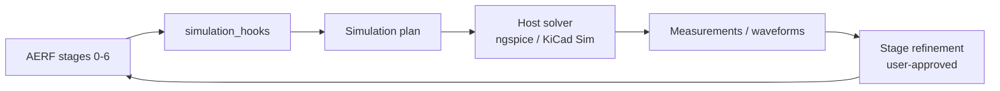

# ADP-006: Simulation Abstraction

[Home](../../README.md) › [Project Index](../../PROJECT_INDEX.md) › [Architecture](README.md) › ADP-006

**Status:** Approved (architecture defined; closed-loop implementation in progress)

**Owner:** Project maintainers

**Applies To:** Simulation abstraction and AERF closed-loop refinement

**Version:** 1.0

**Date:** 2026-08-07

**Builds on:** [ADP-008: AI Engineering Reasoning Framework](ADP-008-AI-Engineering-Reasoning-Framework.md) (v1.1), [ADP-009: Host Integration Layer](ADP-009-Host-Integration-Layer.md) (v1.0), [ADP-010: Engineering Inference Engine](ADP-010-Engineering-Inference-Engine.md) (v1.0)

---

## 1. Purpose

This Architectural Design Proposal defines **simulation abstraction** — host-agnostic hooks for validating and refining AERF stage conclusions using simulation and measurement results.

Today, SPICE netlist export, SUBCKT generation, and spice write-back are implemented in the KiCad host (`--ui-simulation`, `src/inference/simulation.py`). This ADP specifies how simulation results should feed back into staged reasoning without binding platform logic to ngspice or KiCad Simulator.

---

## 2. Problem Statement

AERF establishes engineering understanding before simulation ([ADP-008 §13](ADP-008-AI-Engineering-Reasoning-Framework.md#13-simulation-philosophy)). Simulation should **validate and refine** prior determinations, not replace staged reasoning.

Without an explicit abstraction:

- Simulation workflows stay host-adjacent (`simulation_supply.py` patterns)
- AERF `simulation_hooks` from stage outputs have no standard consumption path
- Closed-loop refinement (run sim → compare → update stage conclusions) cannot be traced in the task list or ADRs

---

## 3. Goals

Simulation abstraction shall:

- Define a host-neutral contract for simulation requests and results (waveforms, measurements, pass/fail assertions)
- Map AERF `simulation_hooks` to executable simulation plans
- Feed validated measurements back into stage refinement (closed loop) with user approval
- Remain independent of ngspice, KiCad Simulator, or any single solver
- Complement existing SUBCKT tooling (`facts` → `synthesis`) without conflating model creation with AERF stages

---

## 4. Non-Goals

This ADP does NOT:

- Replace KiCad netlist export or SUBCKT generation (already implemented in host)
- Mandate automatic simulation without user approval
- Require ngspice TRAN convergence for platform acceptance (host/solver concerns)
- Define full `measurement` field semantics in EKM (extends ADP-002; detailed shapes deferred until implementation)

---

## 5. Relationship to Existing Work

| Capability | Status | Location |
|------------|--------|----------|
| SPICE netlist export | Implemented | `src/context/netlist_export.py`, `kicad-cli` |
| SUBCKT gap scan and generation | Implemented | `src/inference/simulation.py`, `--ui-simulation` |
| Built-in sim model auto-apply | Implemented | `src/context/builtin_sim_models.py` |
| AERF `simulation_hooks` in stage output | Defined | [AERF Stage Index](../Engineering_Knowledge/AERF_Stage_Index.md) |
| Closed loop: sim results → stage refinement | **Not implemented** | Future `src/inference/` or host adapter |

The two-stage SUBCKT pipeline is a **tooling workflow** (model creation), not an AERF stage. AERF Stage 7 may request SUBCKT models via `simulation_hooks` when simulation is needed.

---

## 6. Closed-Loop Model (planned)

1. Prior stages emit `simulation_hooks` describing what to simulate and which determination would be validated.
2. EIE or host adapter translates hooks into a simulation plan (netlist, analysis type, probes).
3. Host runs solver; results normalize to a platform `SimulationResult` shape (future).
4. Refined determinations merge into accumulated stage context only after user approval.
5. Optional EKM write-back follows [ADP-007](ADP-007-AERF-Prompt-Integration.md) approval gates.

---

## 7. Host Responsibilities (KiCad reference)

| Responsibility | KiCad implementation today |
|----------------|----------------------------|
| Export netlist | `netlist_export.py`, `kicad-cli` |
| Apply spice fields | `schematic_sim_write.py`, `builtin_sim_models.py` |
| Run solver | KiCad Simulator / external ngspice (user-driven) |
| Surface errors in UI | Partial (`--ui-simulation`; pdftoppm/ngspice error surfacing in chat still open) |

---

## 8. Implementation Status

| Milestone | Status |
|-----------|--------|
| Netlist export + SUBCKT pipeline | Implemented |
| Simulation panel UI | Implemented (`--ui-simulation`) |
| Host-agnostic `SimulationResult` contract | Implemented (`src/inference/simulation_types.py`) |
| `simulation_hooks` → plan translation | Implemented (`src/inference/simulation_closed_loop.py`) |
| Closed-loop stage refinement | Implemented (`build_refinement_from_simulation`, user approval gate) |
| EKM measurement artifact references from sim | Not implemented |

---

## 9. Acceptance Criteria

- [x] Host-neutral simulation result contract defined in `src/inference/simulation_types.py`
- [x] AERF `simulation_hooks` can be translated to an executable plan without KiCad imports in platform code
- [x] Simulation results can refine prior stage determinations with explicit user approval
- [ ] Closed-loop workflow traced in [MASTER_TASK_LIST](../../tasks/MASTER_TASK_LIST.md) and [Feature Overview](../User_Guides/Feature_Overview.md)
- [x] SPICE netlist export and SUBCKT assistance (partial — no closed loop)

---

## Related Documents

- [ADP-008: AI Engineering Reasoning Framework](ADP-008-AI-Engineering-Reasoning-Framework.md)
- [ADP-010: Engineering Inference Engine](ADP-010-Engineering-Inference-Engine.md)
- [Platform Architecture](Platform_Architecture.md)
- [Custom Trifilar Coil Simulation Setup](../User_Guides/Custom_Trifilar_Coil_Simulation_Setup.md)
- [Master Task List](../../tasks/MASTER_TASK_LIST.md)

## Parent

- [Architecture](README.md)
