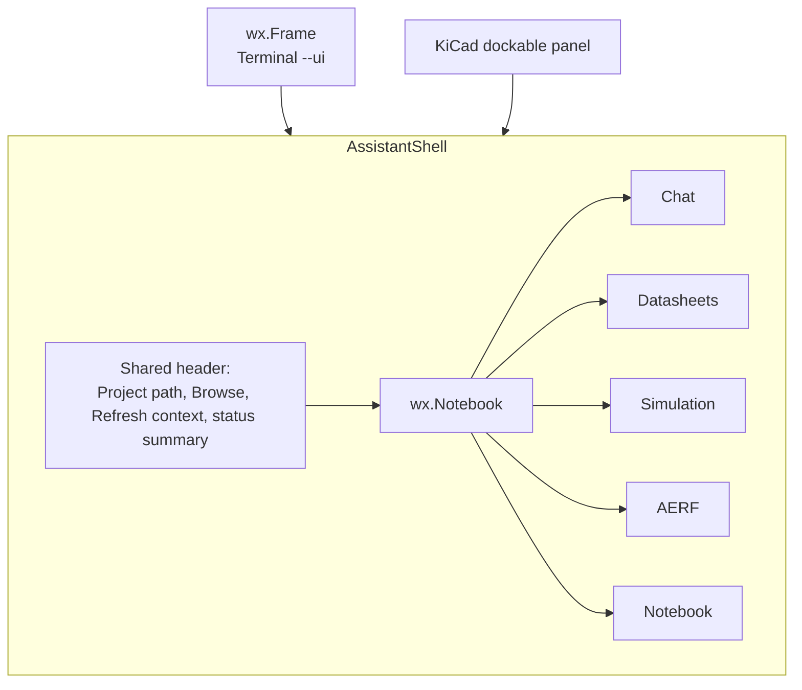
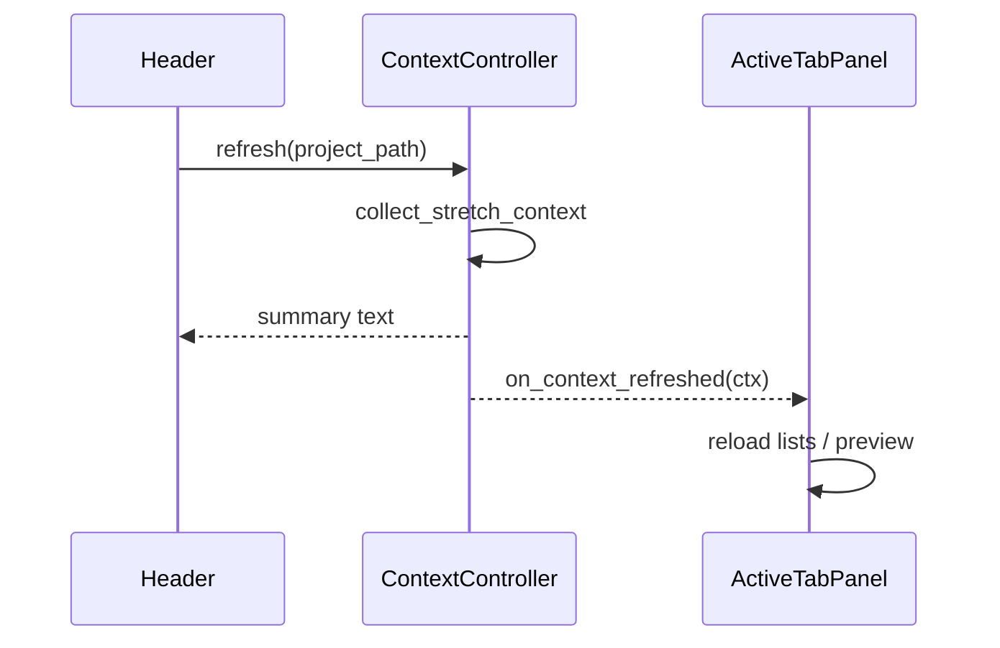

# ADP-011: Assistant Shell User Interface

[Home](../../README.md) › [Project Index](../../PROJECT_INDEX.md) › [Architecture](README.md) › ADP-011

**Status:** Partial (Phase 1 scaffold — `src/ui/assistant_shell.py`, `--ui`; embedded tabs and KiCad dock Phase 2)

**Author:** Ed Becnel

**Project:** KiCad AI Integration (first host reference implementation)

**Version:** 1.0

**Date:** 2026-07-31

**Builds on:** [ADP-003: Engineering Notebook User Interface](ADP-003-Engineering-Notebook-User-Interface.md), [ADP-009: Host Integration Layer](ADP-009-Host-Integration-Layer.md)

**Related ADRs:** [ADR-0006: Engineering Notebook User Interface](ADRs/ADR-0006-Engineering-Notebook-UI.md)

---

## 1. Purpose

This Architectural Design Proposal defines the **Assistant Shell** — a single, tabbed KiCad AI Assistant window that replaces the current launcher plus stack of separate modal feature dialogs.

The shell is the planned primary host UI surface for Terminal launch (`--ui`) and the Phase 2 KiCad dockable plugin. **Phase 1 ships a scaffold:** shared project header, tab bar, and modal panel opens per tab (`assistant_shell.py`). Embedded tab content and dockable plugin hosting remain Phase 2.

---

## 2. Problem Statement

Today's host UI (`src/ui/`) uses a **launcher dialog** that opens **separate modal dialogs** per feature:

| Current entry | Window title | Feature |
|---------------|--------------|---------|
| `--ui` | KiCad AI Assistant | Launcher (project picker + panel buttons) |
| `--ui-chat` | KiCad AI Assistant | Chat |
| `--ui-datasheets` | Datasheets | Attach PDF, AI discovery |
| `--ui-simulation` | Simulation models (SUBCKT) | Gap scan, SUBCKT generation |
| `--ui-aerf` | AERF | Staged analysis |
| `--ui-notebook` | Engineering Notebook | EKM editing |

Pain points observed in real use:

1. **Launcher is easy to miss** — Chat opens as a second modal on top; both Launcher and Chat use the title **"KiCad AI Assistant"**.
2. **Datasheet attach/find is hidden** — users expect PDF controls in Chat; they live only in the Datasheets dialog.
3. **Duplicated context refresh** — each panel collects or refreshes project context independently.
4. **Fragmented workflow** — a typical path (datasheets → simulation → chat) spans multiple windows with no guided navigation.

---

## 3. Goals

The Assistant Shell shall:

- Present **one window** with a **shared project header** and **feature tabs** (Chat, Datasheets, Simulation, AERF, Notebook).
- Use the **same shell component** in two hosts from implementation day one:
  - **Standalone** — `wx.Frame` for Terminal `--ui` launch.
  - **Docked** — KiCad action plugin panel alongside schematic/PCB editor.
- **Centralize context collection** — refresh once in the header; tabs react to updated `ProjectContext`.
- **Preserve CLI deep links** — `--ui-datasheets`, `--ui-chat`, etc. open the unified shell focused on the correct tab.
- **Preserve ADR-0006 boundaries** — Chat and Notebook remain sibling surfaces; tabs organize navigation, they do not merge conversation content with EKM editing.

---

## 4. Non-Goals

This ADP does NOT:

- Merge Engineering Notebook content into the Chat panel (rejected in [ADR-0006](ADRs/ADR-0006-Engineering-Notebook-UI.md) §Alternatives Considered).
- Replace platform frameworks (EKM, AERF, EIE, prompts, providers) — shell is host UI only per [ADP-009](ADP-009-Host-Integration-Layer.md).
- Mandate implementation in this documentation phase.
- Remove headless CLI paths (`--ask`, `--aerf-plan`, JSON context dump).

---

## 5. Target User Experience



### 5.1 Shared header (replaces launcher)

Reuses logic from [`src/ui/launcher_dialog.py`](../../src/ui/launcher_dialog.py):

- Project path field + **Browse…** / **Folder…**
- **Refresh context** (single source of truth)
- Read-only summary: symbols, datasheet counts, SPICE netlist line, simulation gap count
- Optional: tab badges (e.g. Datasheets tab shows missing count)

### 5.2 Feature tabs

| Tab | Role | Current dialog |
|-----|------|----------------|
| **Chat** | Ask questions; Approve & Send; context preview | [`chat_dialog.py`](../../src/ui/chat_dialog.py) |
| **Datasheets** | Attach PDF, AI find, reset links | [`missing_datasheets_dialog.py`](../../src/ui/missing_datasheets_dialog.py) |
| **Simulation** | Gap scan, SUBCKT generation, spice write-back | [`simulation_dialog.py`](../../src/ui/simulation_dialog.py) |
| **AERF** | Staged analysis; EKM write-back | [`aerf_dialog.py`](../../src/ui/aerf_dialog.py) |
| **Notebook** | EKM view/edit | [`notebook_shell.py`](../../src/ui/notebook_shell.py) (already embeddable) |

---

## 6. Proposed Module Layout (future implementation)

| Module | Role |
|--------|------|
| `src/ui/assistant_shell.py` | Top-level `wx.Panel`: header + `wx.Notebook` + tab wiring |
| `src/ui/context_controller.py` | Holds `ProjectContext`, refresh state, summary text; emits refresh events |
| `src/ui/assistant_frame.py` | Standalone `wx.Frame` host for Terminal |
| `src/ui/assistant_dock_panel.py` | Thin KiCad embedding adapter (parallels [`notebook_panel.py`](../../src/ui/notebook_panel.py)) |
| `*Panel` classes | Tab bodies extracted from existing `*Dialog` classes |

[`NotebookShell`](../../src/ui/notebook_shell.py) is already a `wx.Panel` and is the reference pattern for other tab migrations.

---

## 7. Tab Panel Protocol (design only)

Each tab panel implements a small host contract:

```python
class AssistantTabPanel(wx.Panel):
    def on_context_refreshed(self, ctx: ProjectContext) -> None: ...
    def on_tab_selected(self) -> None: ...  # optional lazy load
```

**Context refresh flow:**



Long-running tab actions (AI send, SUBCKT generation) remain on background threads as today. Only context collection is centralized.

---

## 8. CLI Behavior (when implemented)

| Flag | Behavior |
|------|----------|
| `--ui` | Open `AssistantFrame` with default tab (Chat or last-used per project) |
| `--ui-chat` | Open shell; select **Chat** tab |
| `--ui-datasheets` | Open shell; select **Datasheets** tab |
| `--ui-simulation` | Open shell; select **Simulation** tab |
| `--ui-aerf` | Open shell; select **AERF** tab |
| `--ui-notebook` | Open shell; select **Notebook** tab |

[`src/ui/launcher.py`](../../src/ui/launcher.py) becomes a thin facade exporting `show_assistant_shell()` for the script and future plugin.

During migration, legacy `show_*_dialog()` wrappers may remain temporarily; they are removed in the cleanup phase.

---

## 9. Alignment With Existing Architecture

| Document | Relationship |
|----------|--------------|
| [ADR-0006](ADRs/ADR-0006-Engineering-Notebook-UI.md) | Tabbed siblings satisfy "chat and notebook as sibling surfaces"; does not merge notebook into chat |
| [ADP-003](ADP-003-Engineering-Notebook-User-Interface.md) | Notebook tab hosts existing `NotebookShell`; EKM View Model unchanged |
| [ADP-009](ADP-009-Host-Integration-Layer.md) | Shell lives in `src/ui/`; platform code unchanged |

---

## 10. Migration Phases (deferred — future implementation)

### Phase A — Shell skeleton

- Add `AssistantShell`, `ContextController`, `AssistantFrame`, `AssistantDockPanel`.
- Wire `--ui` to frame; **Notebook** tab first (proves embed pattern).

### Phase B — Migrate remaining tabs

Order: Datasheets → Simulation → Chat → AERF (matches typical user workflow).

### Phase C — Polish and plugin

- Tab badges, remember last tab per project, keyboard shortcuts.
- KiCad action plugin registers dockable `AssistantDockPanel`.

### Phase D — Cleanup

- Remove `LauncherDialog` and modal-only entry paths.
- Add `tests/ui/test_assistant_shell.py` (tab selection, context propagation, CLI deep links).

---

## 11. Current Workaround (until shell is built)

Datasheet attach and AI discovery are **not** in the Chat panel. Use one of:

```bash
python scripts/run_ai_assistant.py "/path/to/project.kicad_pro" --ui-datasheets
```

Or from the launcher (`--ui`): click **Datasheets** (not Chat) — look for the window titled **"Datasheets"**.

See [Testing With Your KiCad Project](../User_Guides/Testing_With_Your_KiCad_Project.md) for the full walkthrough.

---

## 12. Success Criteria

### Documentation phase (this ADP)

- User preference and target UX are discoverable without chat history.
- Implementers can start shell work without re-deciding architecture.
- Current workaround is documented so users are not blocked on datasheet attach.

### Implementation phase (future)

- One visible window for all workflows; no hidden launcher behind Chat.
- Same `AssistantShell` in Terminal and KiCad dock.
- CLI deep links preserved.
- ADR-0006 authority boundaries preserved.

---

## 13. References

- [Feature Overview](../User_Guides/Feature_Overview.md) — planned UX summary for users
- [MASTER_TASK_LIST](../../tasks/MASTER_TASK_LIST.md) — Phase 2 tracking
- [07_E2E_Full_Flow.md](../Developer_Handbook/07_E2E_Full_Flow.md) — current and future E2E paths
- [KiCad Software Architecture](KiCad_AI_Integration_Software_Architecture.md)

## Parent

- [Architecture](README.md)
