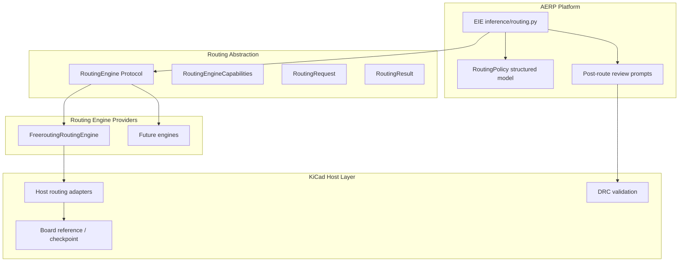

# ADP-013: Routing Abstraction

[Home](../../README.md) › [Project Index](../../PROJECT_INDEX.md) › [Architecture](README.md) › ADP-013

> **Status:** Draft
> **Owner:** Project maintainers
> **Applies To:** Routing capability architecture (host-agnostic)
> **Last Reviewed:** 2026-08-23
> **Review Frequency:** Quarterly
> **Authoritative:** No

**Author:** Ed Becnel

**Project:** KiCad AI Integration (first host reference implementation)

**Version:** 1.0

**Date:** 2026-08-23

**Origin:** Restructured from Freerouting integration planning handover (2026-08-23). Freerouting-specific details live in [Freerouting Integration](../Specifications/Freerouting_Integration.md).

**Builds on:** [ADP-006: Simulation Abstraction](ADP-006-Simulation-Abstraction.md), [ADP-009: Host Integration Layer](ADP-009-Host-Integration-Layer.md), [ADP-010: Engineering Inference Engine](ADP-010-Engineering-Inference-Engine.md), [ADP-012: Learning and Canonical Knowledge](ADP-012-Learning-and-Canonical-Knowledge.md)

---

## 1. Purpose

This Architectural Design Proposal defines **routing abstraction** — a host-agnostic capability for delegating physical PCB routing to replaceable external routing engines while KAI retains responsibility for design intent, routing policy, constraint translation, validation, and user authority.

> **Freerouting solves routing. KAI solves PCB design intent.**

This document describes the general routing capability and architecture. It does **not** define Freerouting-specific integration. Freerouting is the first reference implementation; see [Freerouting Integration](../Specifications/Freerouting_Integration.md).

---

## 2. Problem Statement

PCB routing quality depends on engineering decisions made before any router is invoked. An autorouter may produce electrically connected traces that are still poor engineering results without sufficient constraints and routing intent.

Without an explicit abstraction:

- Routing workflows would couple KAI to a single router's file formats and CLI
- Design intent would not be separated from physical route generation
- Post-route validation and user approval would lack a standard contract
- Future routing engines could not be substituted without platform changes

---

## 3. Goals

Routing abstraction shall:

- Define an engine-independent `RoutingEngine` contract and `RoutingRequest` / `RoutingResult` types
- Express routing policy as structured, engine-independent data (persistence mechanism TBD)
- Support replaceable routing engine implementations behind a capability abstraction
- Preserve authoritative board state via a transactional checkpoint workflow
- Enable post-route validation (DRC, constraint checks, AI review) before accepting results
- Require user authority and explainability for routing classifications and exclusions
- Remain independent of Freerouting, Specctra DSN/SES, or any single router
- Not prevent a future higher-level Engineering Engine Provider abstraction

---

## 4. Non-Goals

This ADP does NOT:

- Define Freerouting-specific DSN/SES exchange (see [Freerouting Integration](../Specifications/Freerouting_Integration.md))
- Mandate automatic routing without user approval
- Assume EKM as the routing policy persistence layer
- Implement critical-net AI classification (Phase 4)
- Implement closed-loop re-routing optimization (Phase 5)
- Prematurely generalize simulation and routing into a shared Engineering Engine Provider framework
- Replace KiCad's native routing tools or Freerouting plugin for interactive use

---

## 5. Conceptual Separation

Do not conflate these concepts:

```text
Capability              = what engineering function KAI needs (e.g. PCB routing)
Capability Abstraction  = KAI's domain-specific contract (RoutingEngine)
Provider/Implementation = concrete engine (e.g. FreeroutingRoutingEngine)
Tool Adapter            = host integration code (format exchange, subprocess)
External Tool           = the specialized application (e.g. Freerouting)
```

Replaceable routing engines:

```text
RoutingEngine
    ├── FreeroutingRoutingEngine      (first/reference — see specification)
    ├── FutureKiCadRoutingEngine
    ├── FutureCommercialRoutingEngine
    └── FutureAIRoutingEngine
```

---

## 6. Distinct Domain Concepts

These concepts are **not** the same and must not automatically share a persistence model:

```text
PCB design intent
Routing policy
Routing-engine input
Routing execution state
Routing result
Engineering knowledge learned from routing
Canonical knowledge
```

Phase 3 requirement:

> **Routing policy SHALL have a structured, engine-independent representation.**

Persistence mechanism is decided separately after lifecycle and ownership are understood. **Do not assume EKM** as the routing policy store.

---

## 7. Operational Results vs Canonical Knowledge

Per [ADP-012](ADP-012-Learning-and-Canonical-Knowledge.md) and CRA/ELS:

```text
Operational Routing Result  ≠  Canonical Knowledge

Operational Result
    ↓
Evidence / Learning Candidate
    ↓
Evaluation
    ↓
Possible Canonical Knowledge
```

A routing result, failure, optimization outcome, or AI observation may become evidence or a learning candidate. It does **not** automatically become canonical knowledge.

---

## 8. Architecture Overview



**Key boundary:** Exchange formats (e.g. Specctra DSN/SES) are **not** part of the generic `RoutingEngine` contract. They belong in provider-specific adapters documented in engine specifications.

```text
RoutingRequest (engine-independent)
    ↓
RoutingEngine
    ↓
Provider implementation (e.g. FreeroutingRoutingEngine)
    ↓
Host adapters (format exchange, subprocess)
    ↓
External engine
```

---

## 9. RoutingEngine Contract

Settled for Phase 2 implementation. Types live in `src/routing/types.py`.

```python
class RoutingEngine(Protocol):
    def capabilities(self) -> RoutingEngineCapabilities: ...
    def route(self, request: RoutingRequest) -> RoutingResult: ...
```

### RoutingRequest (engine-independent)

| Field | Description |
|-------|-------------|
| `board_reference` | Host-neutral board identity (project path, PCB path, checkpoint id) |
| `routing_policy` | Structured routing intent (classifications, priorities) |
| `routing_constraints` | Width, clearance, layer usage constraints |
| `routing_exclusions` | Nets/net-classes excluded from autorouting |
| `preserved_routes` | Existing routes that must not be overwritten |
| `execution_options` | Timeout, batch mode, progress reporting preferences |

DSN paths, SES paths, and Specctra-specific fields **must not** appear here.

### RoutingResult (engine-independent)

| Field | Description |
|-------|-------------|
| `success` | Whether routing completed without fatal errors |
| `artifact_references` | Content-addressed references to engine output artifacts |
| `routed_net_count` | Nets successfully routed (if known) |
| `unrouted_net_count` | Nets remaining unrouted (if known) |
| `log_references` | References to routing logs |
| `errors` | Human-readable error messages |
| `provenance` | Engine id, version, invocation metadata |

### RoutingEngineCapabilities

Capability flags exposed by each provider (examples):

- `supports_automatic_routing`
- `supports_batch_mode`
- `supports_net_class_exclusions`
- `supports_incremental_routing`
- `supports_route_optimization`
- `supports_progress_reporting`

Future orchestration may select providers by capability rather than tool name. Capability negotiation is **not** implemented in Phase 2.

---

## 10. Transactional Routing Workflow

The live authoritative PCB must **not** be destructively modified because an external router produced a result.

```text
Original Board (authoritative)
    ↓
Checkpoint / Preserved State
    ↓
Routing Candidate
    ↓
DRC / AI / Constraint Validation
    ↓
Accept / Reject / Revise
```

**Broader implication (document only):** This pattern may apply to other KAI-generated engineering transformations and may become a common characteristic of a future Engineering Engine Provider architecture:

```text
Authoritative Engineering State
    ↓
Candidate Transformation / Result
    ↓
Validation
    ↓
Human Approval
    ↓
Accepted Engineering State
```

---

## 11. User Authority and Explainability

KAI remains an engineering assistant. The user must be able to:

- inspect routing classifications and exclusions
- understand why a net was excluded
- override classifications
- preserve manual routes
- approve routing execution
- accept or reject results
- request another routing attempt
- compare candidate results

AI routing decisions must **not** silently become authoritative.

Explainability applies to future Engineering Engine Providers: what tool was invoked, why, what constraints were supplied, what result was produced, how it was evaluated, and what user decision is required.

---

## 12. Layering and Package Structure

| Layer | Package | Responsibility |
|-------|---------|----------------|
| Platform contracts | `src/routing/` | `RoutingEngine` Protocol, types, errors, factory |
| EIE orchestration | `src/inference/routing.py` | Workflow: policy → engine → validate → surface |
| Host adapters | `src/context/` | Board checkpoint, format exchange (provider-specific modules) |
| CLI discovery | `src/utils/` | External tool resolution (provider-specific) |
| Prompts | `src/prompts/templates/` | Policy generation, post-route review |
| UI | `src/ui/` | Optional routing tab; re-export from inference |

**Import boundary:** `routing/`, `inference/`, `platform_core/` must **not** import `pcbnew`, wxPython, or KiCad parsers.

---

## 13. Relationship to Existing Work

| Capability | Status | Location |
|------------|--------|----------|
| PCB geometry extraction | Implemented | `src/context/pcb_extract.py` |
| PCB layout audit prompt | Implemented | `src/prompts/templates/pcb_layout.py` |
| DRC report reading | Implemented | `src/context/erc_drc_summary.py` (reads reports; no live DRC run) |
| Routing engine abstraction | **Phase 2** | `src/routing/` |
| Freerouting reference implementation | **Phase 2** | `src/routing/freerouting.py`, [Freerouting Integration](../Specifications/Freerouting_Integration.md) |
| Structured routing policy | **Phase 3** | `src/routing/policy.py` |
| AI critical-net classification | **Phase 4** | `src/prompts/templates/routing_policy.py` |
| Closed-loop re-routing | **Phase 5** | Deferred |

---

## 14. Phased Implementation

### Phase 1 — Investigation and architecture (complete)

- ADP-013 drafted (this document)
- [Freerouting Integration](../Specifications/Freerouting_Integration.md) specification created
- KiCad DSN/SES automation mechanisms investigated (see specification §Phase 1 Findings)
- Simulation vs Routing comparison documented (Appendix A)
- Engineering Engine Provider pattern documented (Appendix B)
- Engine-independent contract settled (§9)

### Phase 2 — Minimal POC (gated)

Vertical slice: checkpoint → route via Freerouting → validate → accept/reject candidate.

Gate checklist:

- [x] ADP-013 is routing-engine-neutral
- [x] KiCad DSN export automation mechanism confirmed (pcbnew; not kicad-cli)
- [x] KiCad SES import automation mechanism confirmed (pcbnew; not kicad-cli)
- [x] `RoutingRequest` / `RoutingEngine` contract engine-independent
- [x] Freerouting modeled as independently installed external engine (specification)
- [x] Engineering Engine Provider relationship documented without premature framework
- [ ] Architecture review approved (human)

### Phase 3 — Routing policy

- Structured, engine-independent `RoutingPolicy` representation
- Persistence mechanism **TBD**
- Net exclusions, preserved routes, user approval gate
- Explainability strings per exclusion

### Phase 4 — AI-assisted routing intelligence

- Critical-net classification
- Pre-route placement review
- Post-route review (extends `pcb_layout.py`)
- Routing quality metrics as structured report

### Phase 5 — Closed-loop optimization

- Compare routing candidates
- Adjust constraints / placement with user approval
- Learning candidates enter ADP-012 evaluation pipeline — not automatic canonicalization

---

## 15. Acceptance Criteria

- [x] Engine-independent `RoutingEngine` contract defined in `src/routing/`
- [x] Freerouting-specific details confined to [Freerouting Integration](../Specifications/Freerouting_Integration.md)
- [ ] Freerouting POC: checkpoint → route → validate → accept/reject (Phase 2)
- [ ] Structured routing policy representation (Phase 3)
- [ ] Post-route AI review prompt (Phase 4)
- [ ] Transactional workflow enforced — no destructive live-board mutation
- [ ] Operational routing results do not auto-enter canonical knowledge

---

## Appendix A — Simulation vs Routing Comparison

| Aspect | Simulation ([ADP-006](ADP-006-Simulation-Abstraction.md)) | Routing (ADP-013) |
|--------|-----------------------------------------------------------|-------------------|
| Domain contract | Simulation hooks / plan / result | Routing policy / request / result |
| First provider | ngspice / KiCad Sim | Freerouting |
| Exchange format | SPICE netlist | Provider-specific (Specctra DSN/SES for Freerouting only) |
| Host adapter role | Netlist export, spice write-back | Board checkpoint, format exchange, result import |
| Transactional workflow | User-approved write-back | Checkpoint → candidate → accept/reject |
| Closed loop | Deferred | Deferred (Phase 5) |
| Optional dependency | ngspice / KiCad Sim | Freerouting (independently installed) |
| AI role | Validate/refine AERF determinations | Classify nets, generate policy, post-route review |

**Common characteristics:**

- KAI owns engineering intent; external engine owns specialized computation
- Replaceable provider behind domain-specific abstraction
- User approval gates before authoritative state changes
- Host adapters isolate format/tool specifics from platform code
- Graceful degradation when external tool unavailable

**Meaningful differences:**

- Simulation validates prior reasoning; routing generates new geometry
- Routing has stronger transactional state requirements (checkpoint workflow)
- Routing policy has richer exclusion/preservation semantics
- Simulation hooks originate from AERF stages; routing policy may originate from PCB context + AI

---

## Appendix B — Engineering Engine Provider Pattern (Watch Item)

KAI is developing capability-specific abstractions (Simulation, Routing). The same pattern is likely to recur for thermal, SI, EMI/EMC, electromagnetic, mechanical, manufacturing, FPGA synthesis, firmware analysis, and other external engineering solvers.

```text
KAI Engineering Intelligence
        ↓
Engineering Intent
        ↓
Capability-Specific Abstraction
        ↓
Engineering Tool / Engineering Engine Provider
        ↓
Tool-Specific Adapter
        ↓
Specialized External Engineering Engine
        ↓
Generated Engineering Artifact / Analysis Result
        ↓
KAI Validation / Interpretation
        ↓
Human Review / Approval
```

**Principle:**

> Recognize the common pattern now. Generalize only when the stable common semantics are understood.

**Do NOT do yet:**

- Refactor simulation and routing into a generalized `EngineeringEngineProvider` framework
- Force either subsystem into a shared interface prematurely
- Implement capability discovery / provider selection

Revisit when a **third** substantial engineering capability exhibits the same pattern. ADP-013 Routing Abstraction must not prevent a higher-level abstraction later.

See also [Platform Architecture](Platform_Architecture.md) §Engineering Engine Provider Pattern.

---

## Appendix C — Phase 1 Investigation Checklist (from planning handover)

Architecture, KiCad integration, Freerouting, routing constraints, state/safety, and AI integration questions from the original planning handover remain as investigation references. Answers for Phase 1 are captured in [Freerouting Integration](../Specifications/Freerouting_Integration.md) §Phase 1 Findings and this document.

---

## Related Documents

- [Freerouting Integration](../Specifications/Freerouting_Integration.md) — first reference implementation
- [ADP-006: Simulation Abstraction](ADP-006-Simulation-Abstraction.md)
- [ADP-009: Host Integration Layer](ADP-009-Host-Integration-Layer.md)
- [ADP-010: Engineering Inference Engine](ADP-010-Engineering-Inference-Engine.md)
- [ADP-012: Learning and Canonical Knowledge](ADP-012-Learning-and-Canonical-Knowledge.md)
- [Platform Architecture](Platform_Architecture.md)
- [Master Task List](../../tasks/MASTER_TASK_LIST.md)

## Parent

- [Architecture](README.md)
