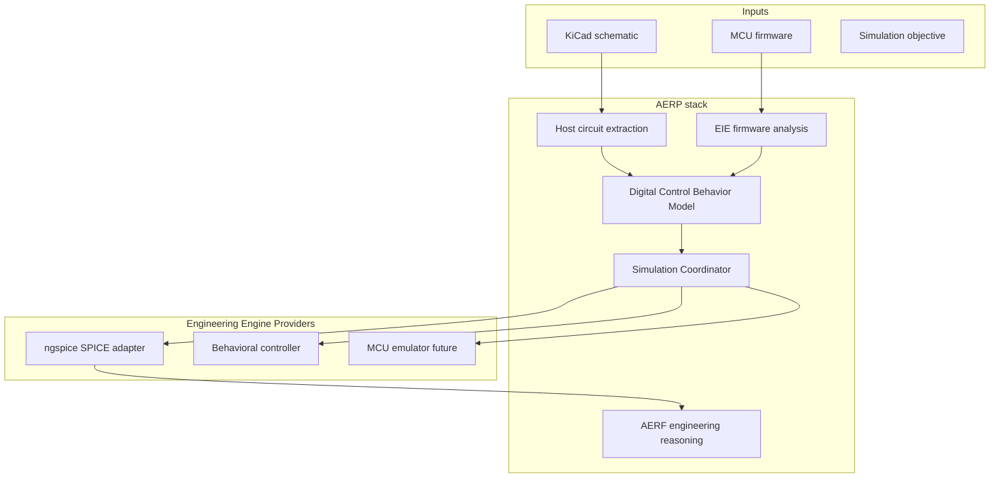

# ADP-014: Firmware-Aware Mixed-Domain Simulation

[Home](../../README.md) › [Project Index](../../PROJECT_INDEX.md) › [Architecture](README.md) › ADP-014

> **Status:** Draft
> **Owner:** Project maintainers
> **Applies To:** Firmware-aware mixed-domain simulation extending ADP-006
> **Last Reviewed:** 2026-08-27
> **Review Frequency:** Annual
> **Authoritative:** No
> **Version:** 1.0

**Builds on:** [ADP-006: Simulation Abstraction](ADP-006-Simulation-Abstraction.md), [ADP-008: AI Engineering Reasoning Framework](ADP-008-AI-Engineering-Reasoning-Framework.md), [ADP-010: Engineering Inference Engine](ADP-010-Engineering-Inference-Engine.md), [Platform Architecture](Platform_Architecture.md)

---

## 1. Purpose

This Architectural Design Proposal defines **firmware-aware mixed-domain simulation** — how the AERP stack simulates MCU-controlled power electronics without modeling the microcontroller as analog circuitry.

The **Engineering Inference Engine (EIE)** orchestrates extraction, firmware analysis, and simulation planning. **AERF** consumes normalized results for staged engineering reasoning. This ADP extends [ADP-006](ADP-006-Simulation-Abstraction.md) (analog closed loop) into the digital/firmware domain; it does not replace it.

A typical example is a power-electronics circuit in which an MCU (e.g. Raspberry Pi Pico / RP2350) controls switching timing, PWM, dead time, startup sequencing, shutdown behavior, or other control logic.

The key architectural principle:

> Do not attempt to model the MCU itself as analog circuitry unless full processor-level co-simulation is explicitly required.

Instead, treat the MCU as a **digital control and timing engine** whose externally visible electrical behavior becomes a set of stimuli, events, or behavioral rules consumed by the analog or mixed-signal simulator.

---

## 2. Problem Statement

[ADP-006](ADP-006-Simulation-Abstraction.md) defines host-neutral analog simulation hooks, plans, and closed-loop stage refinement. That pipeline does not address:

- Firmware source as a simulation input
- Translation of GPIO/PWM timing into SPICE-compatible stimuli
- A simulator-independent digital behavior artifact between firmware interpretation and ngspice syntax
- Progressive maturity from static timing (Level 1) through behavioral control (Level 2) to firmware co-simulation (Level 3)

Today, firmware appears in Chat as optional cross-review context ([`src/context/live/firmware.py`](../../src/context/live/firmware.py), `<pico_firmware>` in [Prompt Architecture](Prompt_Architecture.md)) — not as structured simulation stimuli. Chat firmware review and simulation DCBM generation are **separate paths**.

---

## 3. Goals

Firmware-aware mixed-domain simulation shall:

- Introduce a **Digital Control Behavior Model (DCBM)** as a first-class, simulator-independent artifact
- Support Level 1 static timing extraction (firmware → DCBM → PULSE/PWL) as the initial implementation
- Preserve simulator independence — no direct firmware → ngspice coupling in platform core
- Feed mixed-domain results into existing `SimulationResult` and AERF refinement ([ADP-006](ADP-006-Simulation-Abstraction.md))
- Align with the Engineering Engine Provider pattern ([Platform Architecture](Platform_Architecture.md))
- Document a phased path to behavioral controllers, closed-loop mixed-signal, co-simulation, and HIL

---

## 4. Non-Goals

This ADP does NOT:

- Replace [ADP-006](ADP-006-Simulation-Abstraction.md) analog abstraction or SUBCKT tooling
- Mandate ISA-level or RP2350 emulator co-simulation in the initial release (Level 3 is future)
- Bind simulation to KiCad Simulator only — ngspice and other adapters remain valid
- Run simulation automatically without user approval
- Replace the EKM with a separate "Engineering System Model" store — digital behavior complements [ADP-001](ADP-001-Engineering-Knowledge-Model-Foundation.md) and simulation artifacts

---

## 5. Relationship to Existing Work

| Capability | Status | Location |
|------------|--------|----------|
| Analog `SimulationPlan` / closed loop | Implemented | `src/inference/simulation_types.py`, `simulation_closed_loop.py`, `simulation_runner.py` |
| EKM measurement artifact refs from sim | Implemented | `src/inference/simulation_artifacts.py` |
| Firmware file cross-review (Chat) | Implemented | `src/context/live/firmware.py` |
| Bedini Pico GPIO timing stub | Reference fixture | [examples/bedini_babcock/firmware/pico_gpio_stub/](../../examples/bedini_babcock/firmware/pico_gpio_stub/) |
| **DCBM artifact + firmware→stimuli pipeline** | **Not implemented** | This ADP |
| Level 2 behavioral controller loop | Not implemented | Future |
| Level 3 firmware co-simulation | Not implemented | [Platform backlog](../PLATFORM_BACKLOG.md) |

Proposed per-project artifact path (v1): `kicad_ai/simulation/digital_control_behavior.yaml` (schema TBD; normative field definitions may move to a follow-on specification).

---

## 6. Core Architecture

```text
              MCU firmware / logic
                       |
                       v
          +-------------------------+
          | Digital Control         |
          | Behavior Model (DCBM)   |
          |                         |
          | GPIO timing             |
          | PWM                     |
          | state transitions       |
          | dead time               |
          | enable/disable logic    |
          | fault responses         |
          +------------+------------+
                       |
                 timed events
                       |
                       v
          +-------------------------+
          | Analog Simulation       |
          | ngspice / other engine  |
          |                         |
          | MOSFETs                 |
          | drivers                 |
          | transformers            |
          | LC networks             |
          | feedback                |
          | loads                   |
          +------------+------------+
                       |
                       v
                 Analog results
                       |
                       v
              AERF engineering analysis
```

The MCU does not need to exist as a transistor-level or processor-level analog model for most simulations. The simulation only needs MCU behavior that affects the electrical circuit.



---

## 7. Level 1 — Static Timing (Initial Implementation)

The simplest and most immediately useful case: translate predetermined firmware timing into electrical stimuli.

Example firmware sequence:

```text
GPIO2 HIGH
wait 10 us
GPIO2 LOW

wait 2 us dead time

GPIO3 HIGH
wait 10 us
GPIO3 LOW

repeat
```

Derived behavior:

```text
GPIO2:
0 us     LOW
2 us     HIGH
12 us    LOW
...

GPIO3:
0 us     LOW
14 us    HIGH
24 us    LOW
...
```

SPICE-compatible sources:

```spice
VGPIO_A gpio_a 0 PULSE(0 3.3 2u 5n 5n 10u 24u)

VGPIO_B gpio_b 0 PULSE(0 3.3 14u 5n 5n 10u 24u)
```

Suitable for PWM, complementary MOSFET switching, fixed dead time, periodic pulses, startup sequences, relay sequencing, fixed-frequency inverter drive, and fixed switching patterns.

Pipeline:

```text
Firmware → extracted timing → DCBM → PWL / PULSE sources → ngspice
```

---

## 8. Digital Control Behavior Model (DCBM)

The EIE must not directly couple firmware interpretation to ngspice syntax. Introduce a simulator-independent **Digital Control Behavior Model (DCBM)**.

Example:

```yaml
controller: rp2350

signals:

  gate_a:
    pin: GPIO2
    voltage_high: 3.3
    voltage_low: 0
    events:
      - time: 0us
        state: low
      - time: 2us
        state: high
      - time: 12us
        state: low

  gate_b:
    pin: GPIO3
    voltage_high: 3.3
    voltage_low: 0
    events:
      - time: 0us
        state: low
      - time: 14us
        state: high
      - time: 24us
        state: low
```

Simulation adapters translate DCBM into:

- SPICE `PULSE` / `PWL` / behavioral sources
- XSPICE digital models
- Verilog / VHDL testbench signals
- Other simulator waveform formats
- Hardware-in-the-loop output
- Oscilloscope comparison data

Preferred transformation:

```text
Firmware construct → engineering semantic behavior → DCBM → simulator-specific representation
```

Avoid: `Firmware → ngspice-specific hack`.

---

## 9. Three Levels of MCU Simulation

| Level | Description | Status |
|-------|-------------|--------|
| **Level 1** | Predetermined timing — static GPIO/PWM schedule | Initial target (this ADP) |
| **Level 2** | Behavioral controller — reacts to analog conditions (voltage, current, temperature thresholds) | Future |
| **Level 3** | Actual firmware co-simulation — RP2350 emulator, QEMU, HIL | Advanced / backlog |

### Level 2 — Behavioral Controller (future)

When firmware reacts to analog conditions:

```c
if (voltage > 12.0)
    disable_output();
if (current > 2.0)
    reduce_pwm();
```

Represent as behavioral rules (e.g. duty reduction, shutdown thresholds) exchanged by a **Simulation Coordinator** between controller model and analog solver — not as processor instruction simulation.

### Level 3 — Firmware Co-Simulation (future)

```text
Actual firmware → MCU emulator → GPIO/ADC/PWM → mixed-signal bridge → ngspice
```

Synchronization: ngspice ADC samples → emulator → firmware executes → GPIO → ngspice gate drive. Treat as an advanced backend, not the first implementation.

---

## 10. AI-Assisted Firmware-to-Circuit Translation

The system receives schematic + MCU source + component models + simulation objective. The EIE (via AI) identifies electrically relevant firmware behavior.

Example inference from GPIO timing code:

```text
GPIO2 controls Q1
GPIO3 controls Q2
Q1 ON = 8 us
dead time = 1 us
Q2 ON = 8 us
```

Then generate DCBM and simulator-specific stimuli. This extends — but does not merge with — Chat `<pico_firmware>` cross-review ([Prompt Architecture](Prompt_Architecture.md)).

---

## 11. MCU Function Mapping Reference

| MCU Function | Simulation Representation |
| --- | --- |
| GPIO output | voltage/event source |
| PWM | pulse/PWL source |
| PWM duty changes | time-varying event source |
| ADC input | sampled analog node |
| comparator logic | behavioral threshold |
| timer interrupt | scheduled event |
| state machine | state-transition model |
| PI/PID control | behavioral control block |
| shutdown logic | conditional event |
| GPIO input | digital interpretation of analog node |
| SPI/I2C configuration | state/configuration event when protocol details are irrelevant |

Collapse software implementation details into engineering behavior that affects the circuit (e.g. SPI-configured gate-driver dead time → `Gate driver dead time = 500 ns` in DCBM).

---

## 12. EKM and Simulation Artifacts

Firmware-aware digital behavior is a **conceptual extension** of EKM curated knowledge plus simulation artifacts ([ADP-001](ADP-001-Engineering-Knowledge-Model-Foundation.md), [ADP-006](ADP-006-Simulation-Abstraction.md)) — not a replacement store.

```text
                 AERF
                  |
        EKM + simulation artifacts
                  |
        +---------+---------+
        |                   |
 Digital Behavior       Analog Model
 (DCBM)                     |
        +---------+---------+
                  |
        Simulation Coordinator
                  |
        +---------+---------+
        |         |         |
      SPICE    Digital    Firmware
      Engine    Engine     Emulator
```

---

## 13. Engineering Engine Provider Integration

Aligns with [Platform Architecture](Platform_Architecture.md) and the provider pattern in [ADP-013 Appendix B](ADP-013-Routing-Abstraction.md#appendix-b--engineering-engine-provider-pattern-watch-item).

| Provider (proposed) | Role |
| --- | --- |
| NgspiceProvider | Analog simulation (partial — host reference) |
| XSpiceProvider | Mixed analog/digital simulation |
| FirmwareBehaviorProvider | Source code → DCBM / behavioral model |
| MCU Emulator Provider | Firmware execution (RP2350, future) |
| VerilogProvider / VHDLProvider | Digital simulation |
| HardwareInLoopProvider | Physical controller interaction |

AERF remains above these engines and coordinates them.

---

## 14. Recommended Initial Pipeline

For MCU-controlled switching circuits (e.g. Bedini reference — [examples/bedini_babcock/](../../examples/bedini_babcock/README.md)):

```text
KiCad schematic + MCU firmware
       |
       v
Host circuit extraction
       |
       v
EIE AI firmware analysis
       |
       v
Identify electrically relevant MCU behavior
       |
       v
Generate DCBM
       |
       v
Generate ngspice PWL / PULSE / behavioral stimuli
       |
       v
Run transient simulation
       |
       v
Analyze: switching timing, MOSFET currents, gate voltages,
         dead time, shoot-through, transformer response,
         LC ringing, peak voltages, power dissipation
       |
       v
AERF engineering reasoning
```

Reference validation fixture: [pico_gpio_stub](../../examples/bedini_babcock/firmware/pico_gpio_stub/).

---

## 15. Architectural Decision

The **Digital Control Behavior Model (DCBM) shall become a first-class, simulator-independent AERP artifact**.

It should represent MCU outputs, timing relationships, PWM, sequencing, controller state, input thresholds, conditional behavior, protection logic, startup/shutdown behavior, feedback-control decisions, and digital-to-analog interaction. Simulator adapters convert DCBM into engine-specific representations.

---

## 16. Future Evolution

| Stage | Capability |
|-------|------------|
| 1 | Static digital timing extraction (Level 1) |
| 2 | Behavioral MCU/controller simulation (Level 2) |
| 3 | Closed-loop mixed-signal simulation |
| 4 | Actual firmware co-simulation (Level 3) |
| 5 | Hardware-in-the-loop |

Tracked in [MASTER_TASK_LIST](../../tasks/MASTER_TASK_LIST.md) and [Platform backlog](../PLATFORM_BACKLOG.md).

---

## 17. Acceptance Criteria

- [ ] DCBM schema/version documented (minimal v1: `controller`, `signals`, `events`)
- [ ] Level 1: static timing extraction from firmware stub → DCBM → ngspice PULSE/PWL
- [ ] Simulator adapters remain host-neutral (no firmware imports in platform core)
- [ ] AERF consumes mixed-domain results via existing `SimulationResult` / artifact refs ([ADP-006](ADP-006-Simulation-Abstraction.md))
- [ ] Bedini [pico_gpio_stub](../../examples/bedini_babcock/firmware/pico_gpio_stub/) documented as reference validation fixture
- [ ] Closed-loop workflow traced in [MASTER_TASK_LIST](../../tasks/MASTER_TASK_LIST.md) and [04 — Simulation and SUBCKT](../User_Guides/04_Simulation_and_SUBCKT.md)

---

## 18. Summary

An MCU in a circuit should normally be treated as a **digital control source**, not as part of the analog circuit solver.

The AERP stack should:

1. Read the firmware.
2. Determine which behaviors affect the electrical circuit.
3. Convert those behaviors into a simulator-independent DCBM.
4. Translate DCBM into SPICE or another simulator's input format.
5. Run the appropriate simulation engine.
6. Analyze results using AERF engineering reasoning.
7. Support progressively more advanced closed-loop, firmware-emulated, and hardware-in-the-loop simulation later.

This architecture enables AI-assisted analysis of microcontroller-controlled analog and power-electronics systems while keeping the platform independent of KiCad, ngspice, any single MCU platform, and any single simulation engine.

---

## Related Documents

- [ADP-006: Simulation Abstraction](ADP-006-Simulation-Abstraction.md) — parent analog abstraction
- [ADP-008: AI Engineering Reasoning Framework](ADP-008-AI-Engineering-Reasoning-Framework.md) — simulation philosophy
- [ADP-010: Engineering Inference Engine](ADP-010-Engineering-Inference-Engine.md) — orchestration
- [Platform Architecture](Platform_Architecture.md) — Engineering Engine Provider pattern
- [04 — Simulation and SUBCKT](../User_Guides/04_Simulation_and_SUBCKT.md) — user-facing simulation panel
- [examples/bedini_babcock/README.md](../../examples/bedini_babcock/README.md) — reference workflow and firmware stub
- [MASTER_TASK_LIST](../../tasks/MASTER_TASK_LIST.md)
- [Glossary — DCBM](../Reference/Glossary.md)
- [Prompt Architecture](Prompt_Architecture.md) — Chat `<pico_firmware>` (separate from DCBM path)

## Parent

- [Architecture](README.md)
