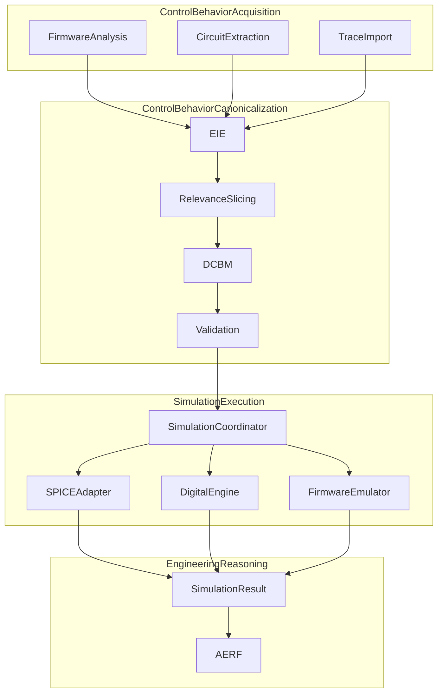

# ADP-014: Firmware-Aware Mixed-Domain Simulation

[Home](../../README.md) › [Project Index](../../PROJECT_INDEX.md) › [Architecture](README.md) › ADP-014

> **Status:** Draft
> **Owner:** Project maintainers
> **Applies To:** Firmware-aware mixed-domain simulation extending ADP-006
> **Last Reviewed:** 2026-08-27
> **Review Frequency:** Annual
> **Authoritative:** No
> **Version:** 1.1

**Builds on:** [ADP-006: Simulation Abstraction](ADP-006-Simulation-Abstraction.md), [ADP-008: AI Engineering Reasoning Framework](ADP-008-AI-Engineering-Reasoning-Framework.md), [ADP-010: Engineering Inference Engine](ADP-010-Engineering-Inference-Engine.md), [Platform Architecture](Platform_Architecture.md)

---

## 1. Purpose

This Architectural Design Proposal defines **firmware-aware mixed-domain simulation** — how the **AERP** stack represents digitally controlled engineering behavior and feeds it into analog or mixed-signal simulation without modeling the controller as analog circuitry.

The **Engineering Inference Engine (EIE)** orchestrates extraction, relevance analysis, DCBM candidate generation, and validation. **AERF** (a framework within AERP, not the umbrella platform itself) consumes normalized `SimulationResult` data for staged engineering reasoning. This ADP extends [ADP-006](ADP-006-Simulation-Abstraction.md) (analog closed loop) into the digital/control domain; it does not replace it.

**Terminology:** **AERP** is the host-agnostic umbrella stack; **AERF** is the staged reasoning framework; **EIE** is the runtime orchestrator. See [Glossary](../Reference/Glossary.md) and [ADR-0010](ADRs/ADR-0010-AERP-Platform-Umbrella-Acronym.md). **AERF ≠ AERP.**

A typical motivating example is a power-electronics circuit in which an MCU (e.g. Raspberry Pi Pico / RP2350) controls switching timing, PWM, dead time, startup sequencing, shutdown behavior, or other control logic. The Pico is the **initial reference implementation**, not the architectural boundary.

The key architectural principle:

> Do not attempt to model the MCU itself as analog circuitry unless full processor-level co-simulation is explicitly required.

Instead, treat the controller as a **digital control source** whose electrically relevant behavior is captured in a **Digital Control Behavior Model (DCBM)** — a simulator-independent engineering contract — and translated into stimuli consumed by analog or mixed-signal solvers.

### Platform independence

This architecture is **not** "Pico simulation support." It must remain independent of:

- KiCad, ngspice, or any single simulator
- Any specific MCU, FPGA, or programmable logic platform
- Any specific firmware or HDL language

It should support, or permit future support for, RP2040/RP2350, STM32, ESP32, Arduino, PIC, AVR, FPGA, CPLD, programmable gate-driver logic, battery management systems, inverter controllers, motor controllers, digital power supplies, robotics, and other embedded control systems.

### Four architecturally distinct concerns

Firmware-aware mixed-domain simulation comprises four concerns:

1. **Control-behavior acquisition** — firmware analysis, measurement import, manual specification, HDL/simulation sources
2. **Control-behavior canonicalization** — electrical relevance, schematic correlation, provenance, confidence, DCBM generation, validation
3. **Simulation execution** — simulator-specific adaptation (SPICE, XSPICE, digital simulation, firmware co-simulation, HIL)
4. **Engineering reasoning** — normalized results, AERF analysis, conclusions, detected risks, design recommendations

The DCBM is the reusable bridge between concerns 1–2 and concern 3.

---

## 2. Problem Statement

[ADP-006](ADP-006-Simulation-Abstraction.md) defines host-neutral analog simulation hooks, plans, and closed-loop stage refinement. That pipeline does not address:

- Firmware, measured traces, or manual control models as structured simulation inputs
- A simulator-independent **engineering contract** between control-behavior producers and simulation consumers
- **Provenance and confidence** distinguishing extracted facts from inferred mappings and AI conclusions
- **Electrical-relevance slicing** — most firmware code is unrelated to a given simulation objective
- **DCBM validation** before simulator adaptation
- Separation of **DCBM producers** (create behavior) from **DCBM consumers** (execute simulation)
- Progressive maturity from static timing (Level 1) through behavioral control (Level 2) to firmware co-simulation (Level 3)

Today, firmware appears in Chat as optional cross-review context ([`src/context/live/firmware.py`](../../src/context/live/firmware.py), `<pico_firmware>` in [Prompt Architecture](Prompt_Architecture.md)) — not as structured simulation stimuli. Chat firmware review and simulation DCBM generation are **separate paths**.

Without explicit provenance, the system could silently convert AI inference into unquestioned engineering fact — for example, inferring `GPIO2 controls Q1` when only `gpio_put(DRIVE_A, 1); sleep_us(8);` is directly supported by firmware static analysis.

---

## 3. Goals

Firmware-aware mixed-domain simulation shall:

- Introduce **DCBM** as a first-class, simulator-independent **engineering contract** — not merely an intermediate representation of firmware timing
- Preserve **provenance, evidence, and confidence** for inferred vs extracted behavior
- Require the EIE to perform **electrical-relevance slicing** guided by the simulation objective
- Validate DCBM candidates before simulator adaptation (**detection ≠ correction**)
- Separate **DCBM producers** from **DCBM consumers** in the Engineering Engine Provider architecture
- Support DCBM origins beyond firmware: measured traces, manual specification, HIL capture, other simulators
- Support Level 1 static timing extraction as the initial implementation path
- Preserve simulator independence — no direct firmware → ngspice coupling in platform core
- Feed mixed-domain results into existing `SimulationResult` and AERF refinement ([ADP-006](ADP-006-Simulation-Abstraction.md))
- Define extensible **DCBM versioning** for future schema evolution
- Document static-analysis limitations and surface **unresolved** behavior rather than silently guessing

---

## 4. Non-Goals

This ADP does NOT:

- Replace [ADP-006](ADP-006-Simulation-Abstraction.md) analog abstraction or SUBCKT tooling
- Define DCBM validation as automatic correction of electrically dangerous behavior (shoot-through, zero dead time, etc.)
- Mandate ISA-level or MCU emulator co-simulation in the initial release (Level 3 is future)
- Bind simulation to KiCad Simulator only — ngspice and other adapters remain valid
- Run simulation automatically without user approval
- Scope architecture to Pico/RP2350 only
- Replace the EKM with a separate store — DCBM complements [ADP-001](ADP-001-Engineering-Knowledge-Model-Foundation.md) and simulation artifacts
- Permit firmware → ngspice direct coupling in AERP platform core

---

## 5. Relationship to Existing Work

| Capability | Status | Location |
|------------|--------|----------|
| Analog `SimulationPlan` / closed loop | Implemented | `src/inference/simulation_types.py`, `simulation_closed_loop.py`, `simulation_runner.py` |
| EKM measurement artifact refs from sim | Implemented | `src/inference/simulation_artifacts.py` |
| Firmware file cross-review (Chat) | Implemented | `src/context/live/firmware.py` |
| Bedini Pico GPIO timing stub | Reference fixture | [examples/bedini_babcock/firmware/pico_gpio_stub/](../../examples/bedini_babcock/firmware/pico_gpio_stub/) |
| **DCBM artifact + producer/consumer pipeline** | **Not implemented** | This ADP |
| Electrical-relevance / simulation-scope slicing | Not implemented | EIE (future) |
| DCBM provenance and confidence metadata | Not implemented | This ADP |
| DCBM validation stage | Not implemented | This ADP |
| Level 2 behavioral controller loop | Not implemented | Future |
| Level 3 firmware co-simulation | Not implemented | [Platform backlog](../PLATFORM_BACKLOG.md) |

Proposed per-project artifact path (v1): `kicad_ai/simulation/digital_control_behavior.yaml` (conceptual fields in this ADP; normative JSON Schema may move to a follow-on specification).

---

## 6. Core Architecture

### End-to-end flow

```text
              Engineering Sources
                     |
       +-------------+--------------+
       |             |              |
   Firmware       Schematic      Measurements
       |             |              |
       v             v              v
 Firmware        Circuit        Trace/Signal
 Analysis        Extraction      Import
       |             |              |
       +-------------+--------------+
                     |
                     v
          Engineering Inference Engine
                     |
              relevance slicing
                     |
                     v
          Digital Control Behavior Model
                     |
          provenance + validation
                     |
                     v
             Simulation Coordinator
                     |
        +------------+-------------+
        |            |             |
      SPICE        Digital       Firmware
      Engine        Engine       Emulator
        |            |             |
        +------------+-------------+
                     |
                     v
          Normalized SimulationResult
                     |
                     v
                    AERF
                     |
                     v
          Engineering conclusions
```



The controller does not need to exist as a transistor-level or processor-level analog model for most simulations. The simulation only needs **electrically relevant control behavior** affecting the circuit.

Preferred transformation (unchanged):

```text
Control-behavior source → engineering semantic behavior → DCBM → simulator-specific representation
```

Avoid: `Firmware → ngspice-specific hack`.

---

## 7. Level 1 — Static Timing (Initial Implementation)

The simplest and most immediately useful case: translate predetermined control timing into electrical stimuli.

Example firmware sequence:

```text
GPIO2 HIGH
wait 10 us
GPIO2 LOW

wait 2 us dead time

GPIO3 HIGH
wait 10 us
GPIO3 LOW

repeat
```

SPICE-compatible sources (via DCBM consumer adapter):

```spice
VGPIO_A gpio_a 0 PULSE(0 3.3 2u 5n 5n 10u 24u)

VGPIO_B gpio_b 0 PULSE(0 3.3 14u 5n 5n 10u 24u)
```

Suitable for PWM, complementary MOSFET switching, fixed dead time, periodic pulses, startup sequences, relay sequencing, fixed-frequency inverter drive, and fixed switching patterns.

Level 1 pipeline (simplified):

```text
Firmware → static analysis → DCBM candidate → validation → PWL/PULSE → ngspice
```

### Static analysis limitations

Level 1 firmware analysis **cannot always** determine timing statically. Examples include:

- Loops dependent on runtime state
- Interrupts, DMA, PIO, multicore behavior
- Asynchronous peripherals and timers derived from runtime configuration
- Input-dependent branches and dynamic PWM reconfiguration
- RTOS scheduling, external interrupts, hardware-generated events

The firmware analyzer should classify behavior (see §11). **Unresolved** behavior must not be silently approximated unless the approximation is explicit and traceable in DCBM provenance.

---

## 8. Digital Control Behavior Model (DCBM)

The EIE must not directly couple firmware interpretation to ngspice syntax. The **Digital Control Behavior Model (DCBM)** is a first-class, simulator-independent engineering artifact representing discrete, digital, firmware-derived, HDL-derived, manually specified, simulated, or **measured** control behavior that materially affects an engineering system.

> The DCBM is not a representation of software implementation details. It is a representation of **electrically relevant control behavior**. The DCBM forms the **contract** between control-behavior **producers** and simulation/analysis **consumers**.

### 8.1 Versioning

DCBM artifacts shall declare a version to support schema evolution:

```yaml
dcbm_version: "1.0"
```

Future schema extensions may include continuous control, sampled-data loops, buses, synchronization, state machines, stochastic timing, jitter, clock drift, multi-controller systems, FPGA logic, and real-time trace bindings. v1 should not assume only GPIO event lists.

### 8.2 Provenance, confidence, and origin

DCBM must distinguish:

| Category | Description |
|----------|-------------|
| Directly extracted firmware facts | e.g. `sleep_us(8)` → 8 µs duration |
| Schematic-derived facts | net labels, pin mappings, connectivity |
| Inferred mappings | e.g. `DRIVE_A` → `Q1.GATE` |
| AI-derived engineering conclusions | semantic behavior from LLM analysis |
| Manually supplied assumptions | user overrides and design intent |

**Principle:** DCBM shall preserve the provenance and confidence of derived digital-control behavior where behavior is inferred rather than directly observed or deterministically extracted.

**Origin / authority classes** (recommended):

| Origin type | Example |
|-------------|---------|
| `extracted` | Static analysis of `main.c` line 142 |
| `inferred` | AI/schematic correlation with confidence 0.93 |
| `measured` | Logic analyzer capture CSV |
| `manually_specified` | Engineer-authored timing table |
| `generated` | Tool output from another pipeline stage |
| `simulated` | Prior simulation run |
| `hardware_observed` | HIL or bench measurement |

### 8.3 Canonical signal semantics

DCBM should conceptually support (not all required in v1 implementation):

- Signal identity; source pin/channel; target schematic node/device
- Logic voltage levels; timing; frequency; duty cycle; phase; dead time
- Startup/shutdown behavior; state transitions; thresholds; protection rules
- Feedback relationships; sampled-data behavior
- Provenance; confidence; simulation scope; assumptions; validation status
- Source artifact references; measured vs inferred vs manually authored origin

### 8.4 Multi-controller support (future)

DCBM must not permanently assume exactly one controller. Future systems may include multiple MCUs, MCU + FPGA, redundant controllers, isolated gate-driver logic, and distributed embedded controllers.

Conceptual schema direction:

```yaml
controllers:
  pico2: { ... }
  fpga1: { ... }
  safety_mcu: { ... }
```

Timing relationships between controllers may matter.

### 8.5 Electrical non-ideality (future)

Level 1 may use ideal PULSE/PWL sources, but DCBM should not assume digital outputs are inherently ideal. Future properties:

```yaml
electrical_characteristics:
  high_voltage: 3.3V
  low_voltage: 0V
  rise_time: 8ns
  fall_time: 6ns
  output_impedance: 25ohm
  propagation_delay: 12ns
  jitter: 2ns
```

### 8.6 Sources beyond firmware

DCBM may originate from:

```text
Firmware ------------------+
Logic analyzer ------------+
Oscilloscope --------------+
Manual specification ------+--> DCBM --> Simulation
HIL capture ---------------+
Other simulator -----------+
AI-derived model ----------+
```

This generalization makes DCBM reusable across acquisition paths, not only firmware-derived timing.

### 8.7 Conceptual example (non-normative)

```yaml
dcbm_version: "1.0"

simulation_objective:
  analyze:
    - MOSFET switching overlap
    - transformer primary current

controllers:
  rp2350:
    origin:
      type: inferred
      source: firmware_static_analysis
      confidence: 0.93

signals:
  gate_a:
    pin: GPIO2
    mapping:
      target: Q1.GATE
      confidence: 0.98
      evidence:
        - schematic_net: DRIVE_A
        - firmware_symbol: DRIVE_A
    timing:
      high_duration: 8us
      source:
        type: extracted
        file: main.c
        line: 142
    voltage_high: 3.3
    voltage_low: 0
    events:
      - time: 0us
        state: low
      - time: 2us
        state: high
      - time: 12us
        state: low
    validation_status: candidate

ignored_firmware_behavior:
  - status_led
  - serial_logging
  - usb_stack
```

Simulation **consumers** translate validated DCBM into SPICE `PULSE`/`PWL`, XSPICE models, Verilog/VHDL testbench signals, waveform comparison data, or HIL output.

---

## 9. Electrical Relevance and Simulation Scope

Firmware projects may contain large amounts of code unrelated to the electrical behavior being simulated (USB stack, serial logging, LEDs, diagnostics, telemetry, UI logic, watchdog management, etc.).

The EIE shall **not** simply perform `Firmware → DCBM`. The architecture defines:

```text
Firmware → electrical relevance analysis → simulation-scope slice → DCBM
```

The **simulation objective** helps determine which firmware behavior matters and is **input to extraction**, not merely a post-simulation analysis instruction.

Conceptual representation:

```yaml
simulation_objective:
  analyze:
    - MOSFET switching overlap
    - transformer primary current
    - output voltage

required_control_behavior:
  - gate_a
  - gate_b

ignored_firmware_behavior:
  - status_led
  - serial_logging
  - usb_stack
```

**Principle:** The EIE shall identify and extract only firmware behavior that can materially affect the requested engineering simulation, while retaining traceability to the omitted and included firmware scope.

---

## 10. DCBM Validation

Expand the pipeline from:

```text
Firmware → DCBM → Simulator adapter
```

to:

```text
Firmware → DCBM candidate → DCBM validation → Simulator adapter
```

Validation should detect or flag conditions including:

- Contradictory events
- Undefined initial states
- Invalid or negative timing intervals
- Impossible periods or invalid duty-cycle relationships
- Missing GPIO voltage levels
- Unresolved schematic mappings
- Controller outputs mapped to nonexistent nodes
- Overlapping complementary switching (potential shoot-through)
- Zero or negative dead time
- Unsupported dynamically computed behavior
- Firmware behavior that static analysis cannot safely determine

### Detection ≠ correction

Validation must **not** automatically "correct" behavior that appears electrically dangerous. Overlapping high-side and low-side MOSFET gate commands may represent a firmware bug, a design error, a deliberate test case, or the exact condition the user wants to investigate.

The validator shall **flag** the condition and preserve the original modeled behavior unless policy or user instruction explicitly requires otherwise.

---

## 11. Static Analysis Classifications

Firmware analyzers should classify control behavior:

| Classification | Meaning |
|----------------|---------|
| `deterministic_static` | Timing fully derivable at analysis time |
| `conditionally_deterministic` | Static given declared constants/branches |
| `runtime_dependent` | Requires runtime state, interrupts, or scheduling |
| `unresolved` | Cannot be safely determined statically |

Unresolved behavior must not be silently approximated. Any approximation must be explicit, traceable in DCBM provenance, and surfaced to the user before simulation proceeds.

---

## 12. Three Levels of Simulation

| Level | Description | Status |
|-------|-------------|--------|
| **Level 1** | Predetermined timing — static GPIO/PWM schedule | Initial target (this ADP) |
| **Level 2** | Behavioral controller — reacts to analog conditions | Future |
| **Level 3** | Actual firmware co-simulation — emulator, QEMU, HIL | Advanced / backlog |

### Level 2 — Behavioral Controller (future)

When firmware reacts to analog conditions, represent behavioral rules exchanged by a **Simulation Coordinator** — not processor instruction simulation.

### Level 2 subdivision (watch item — non-normative)

Level 2 may eventually subdivide:

| Sub-level | Description | Example |
|-----------|-------------|---------|
| **Level 2A** | Event / threshold controller | `IF Vout > 15 V → disable PWM` |
| **Level 2B** | Sampled-data / continuous control | ADC sampling, PI/PID, current-mode control, digital compensation loops |

This distinction is documented for future planning only; it is not normative in v1.

### Level 3 — Firmware Co-Simulation (future)

```text
Actual firmware → MCU emulator → GPIO/ADC/PWM → mixed-signal bridge → ngspice
```

Treat as an advanced backend, not the first implementation.

---

## 13. AI-Assisted Firmware-to-Circuit Translation

The system receives schematic + MCU source + component models + **simulation objective**. The EIE (via AI) identifies electrically relevant behavior and correlates firmware with schematic evidence.

Example — **directly supported** by firmware static analysis:

```c
#define DRIVE_A 2
gpio_put(DRIVE_A, 1);
sleep_us(8);
```

→ GPIO2 asserted for approximately 8 µs (high confidence, `extracted`).

Example — **inferred**, requires additional evidence:

```text
GPIO2 controls Q1
```

Evidence may include schematic net labels, MCU pin mappings, net connectivity, variable naming, and project documentation. DCBM must record mapping provenance and confidence separately from timing extraction.

This extends — but does not merge with — Chat `<pico_firmware>` cross-review ([Prompt Architecture](Prompt_Architecture.md)).

---

## 14. MCU Function Mapping Reference

| MCU Function | Simulation Representation |
| --- | --- |
| GPIO output | voltage/event source |
| PWM | pulse/PWL source |
| PWM duty changes | time-varying event source |
| ADC input | sampled analog node |
| comparator logic | behavioral threshold |
| timer interrupt | scheduled event |
| state machine | state-transition model |
| PI/PID control | behavioral control block |
| shutdown logic | conditional event |
| GPIO input | digital interpretation of analog node |
| SPI/I2C configuration | state/configuration event when protocol details are irrelevant |

Collapse software implementation details into engineering behavior that affects the circuit (e.g. SPI-configured gate-driver dead time → `Gate driver dead time = 500 ns` in DCBM).

---

## 15. EKM and Simulation Artifacts

Firmware-aware digital behavior is a **conceptual extension** of EKM curated knowledge plus simulation artifacts ([ADP-001](ADP-001-Engineering-Knowledge-Model-Foundation.md), [ADP-006](ADP-006-Simulation-Abstraction.md)) — not a replacement store.

Validated DCBM artifacts function as **engineering contracts** stored alongside other simulation artifacts under `kicad_ai/simulation/`. AERF consumes normalized results; EKM may reference DCBM and simulation artifact refs per ADP-006 closed-loop patterns.

---

## 16. Producer and Consumer Provider Architecture

Clarify the Engineering Engine Provider pattern by separating **DCBM producers** from **DCBM consumers**:

```text
FirmwareBehaviorProvider
        |
        | produces
        v
       DCBM
        |
        | consumed by
        v
Simulation Adapter / Engine Provider
```

**Creating engineering behavior ≠ executing engineering simulation.**

| Role | Examples |
| --- | --- |
| **DCBM producers** | C/C++ static firmware analyzer; Arduino/MicroPython analyzers; RP2040/RP2350 analyzer; FPGA logic analyzer; logic-analyzer / oscilloscope trace importer; CSV waveform importer; manually authored control model; HIL capture provider; AI-derived behavioral model |
| **DCBM consumers** | ngspice adapter; XSPICE adapter; Verilog/VHDL simulation provider; mixed-signal simulator; firmware co-simulation bridge; HIL provider; waveform comparison tool |

Aligns with [Platform Architecture](Platform_Architecture.md) and [ADP-013 Appendix B](ADP-013-Routing-Abstraction.md#appendix-b--engineering-engine-provider-pattern-watch-item). AERF remains above normalized results; the Simulation Coordinator orchestrates consumers.

---

## 17. Recommended Initial Pipeline

For MCU-controlled switching circuits (e.g. Bedini reference — [examples/bedini_babcock/](../../examples/bedini_babcock/README.md)):

```text
KiCad schematic
        +
MCU firmware
        +
simulation objective
        |
        v
Host circuit extraction
        |
        v
EIE firmware analysis
        |
        v
Electrical relevance slicing
        |
        v
Firmware/schematic correlation
        |
        v
DCBM candidate generation
        |
        v
DCBM validation
        |
        v
User-visible warnings / unresolved assumptions
        |
        v
Simulator adapter (DCBM consumer)
        |
        v
ngspice PWL / PULSE / behavioral stimuli
        |
        v
Transient simulation
        |
        v
Normalized SimulationResult
        |
        v
AERF engineering reasoning
```

Reference validation fixture: [pico_gpio_stub](../../examples/bedini_babcock/firmware/pico_gpio_stub/).

---

## 18. Architectural Decision

The **Digital Control Behavior Model (DCBM) shall become a first-class, simulator-independent AERP artifact**.

The DCBM is the canonical representation of digital or discrete control behavior relevant to engineering simulation, regardless of whether that behavior originated from firmware, HDL, measured waveforms, manual specification, another simulator, or physical hardware.

It forms the contract between control-behavior producers and simulation/analysis consumers. Simulator adapters convert validated DCBM into engine-specific representations without embedding firmware interpretation in platform core.

---

## 19. Future Evolution

| Stage | Capability |
|-------|------------|
| 1 | Static digital timing extraction (Level 1) |
| 2 | Behavioral MCU/controller simulation (Level 2; possible 2A/2B split) |
| 3 | Closed-loop mixed-signal simulation |
| 4 | Actual firmware co-simulation (Level 3) |
| 5 | Hardware-in-the-loop |
| 6 | Multi-controller DCBM; measured-trace import; electrical non-ideality |

Potential future DCBM schema additions: continuous control, sampled-data loops, buses, synchronization, state machines, stochastic timing, jitter, clock drift, multi-controller systems, FPGA logic, real-time trace bindings.

Tracked in [MASTER_TASK_LIST](../../tasks/MASTER_TASK_LIST.md) and [Platform backlog](../PLATFORM_BACKLOG.md).

---

## 20. Acceptance Criteria

### Schema and versioning

- [ ] DCBM schema/version documented (`dcbm_version`, extensible v1 fields)
- [ ] Schema evolution strategy defined for future non-GPIO constructs

### Provenance and confidence

- [ ] Provenance supported (extracted, inferred, measured, manually_specified, etc.)
- [ ] Inferred mappings distinguishable from deterministic extraction
- [ ] Confidence metadata supported where behavior is inferred
- [ ] Unresolved firmware behavior surfaced rather than silently guessed

### Slicing and validation

- [ ] Simulation-scope / electrical-relevance slicing documented and implemented in EIE
- [ ] DCBM validation architecturally defined; detection-only (no silent auto-correction)
- [ ] Dynamic/runtime-dependent firmware limitations documented (§7, §11)

### Producer/consumer architecture

- [ ] DCBM producer and consumer roles separated in provider architecture
- [ ] Firmware-to-ngspice direct coupling prohibited in platform core
- [ ] DCBM can be manually authored
- [ ] DCBM architecture permits measured waveform and trace sources

### Integration and validation fixtures

- [ ] Level 1: firmware stub → DCBM → ngspice PULSE/PWL validation path exists
- [ ] AERF consumes normalized mixed-domain results via existing `SimulationResult` / artifact refs ([ADP-006](ADP-006-Simulation-Abstraction.md))
- [ ] Bedini [pico_gpio_stub](../../examples/bedini_babcock/firmware/pico_gpio_stub/) remains reference validation fixture
- [ ] Workflow traced in [MASTER_TASK_LIST](../../tasks/MASTER_TASK_LIST.md) and [04 — Simulation and SUBCKT](../User_Guides/04_Simulation_and_SUBCKT.md)

---

## 21. Summary

An MCU or other digital controller in a circuit should normally be treated as a **digital control source**, not as part of the analog circuit solver.

Firmware-aware mixed-domain simulation consists of four architecturally distinct concerns:

1. **Control-behavior acquisition** — firmware analysis, measurement import, manual specification, HDL/simulation sources
2. **Control-behavior canonicalization** — electrical relevance, schematic correlation, provenance, confidence, DCBM generation, validation
3. **Simulation execution** — simulator-specific adaptation via DCBM consumers
4. **Engineering reasoning** — normalized `SimulationResult`, AERF analysis, conclusions, risks, recommendations

The **DCBM** is the reusable bridge between digital/control-domain behavior and engineering simulation — a provenance-aware, validated, simulator-independent engineering contract, not merely a temporary representation of Pico GPIO timing.

This architecture enables AI-assisted analysis of microcontroller-controlled analog and power-electronics systems while keeping AERP independent of KiCad, ngspice, any single MCU platform, any single firmware language, and any single simulation engine.

---

## Related Documents

- [ADP-006: Simulation Abstraction](ADP-006-Simulation-Abstraction.md) — parent analog abstraction
- [ADP-008: AI Engineering Reasoning Framework](ADP-008-AI-Engineering-Reasoning-Framework.md) — simulation philosophy
- [ADP-010: Engineering Inference Engine](ADP-010-Engineering-Inference-Engine.md) — orchestration
- [Platform Architecture](Platform_Architecture.md) — Engineering Engine Provider pattern
- [04 — Simulation and SUBCKT](../User_Guides/04_Simulation_and_SUBCKT.md) — user-facing simulation panel
- [examples/bedini_babcock/README.md](../../examples/bedini_babcock/README.md) — reference workflow and firmware stub
- [MASTER_TASK_LIST](../../tasks/MASTER_TASK_LIST.md)
- [Glossary — DCBM](../Reference/Glossary.md)
- [Prompt Architecture](Prompt_Architecture.md) — Chat `<pico_firmware>` (separate from DCBM path)

## Parent

- [Architecture](README.md)
