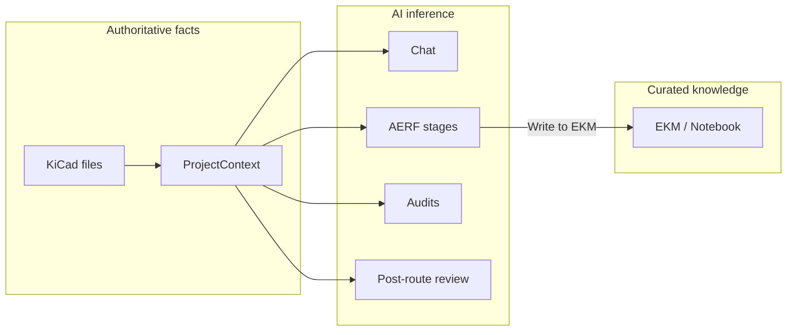

# User Guides

[Home](../../README.md) · [Project Index](../../PROJECT_INDEX.md)

> **Start here** for end-user instructions. For project philosophy, see [Project Overview](../../PROJECT_OVERVIEW.md). For a capability snapshot, see [Feature Overview](Feature_Overview.md).

In the Assistant shell, click **Help** in the header or **?** on any tab to open these guides inside KiCad (rendered markdown with a table of contents).

---

## Reading paths

Choose a path that matches your goal:

| Goal | Read in order |
|------|----------------|
| **New user** | [Getting Started](00_Getting_Started.md) → [Assistant Shell](01_Assistant_Shell.md) → [Chat](02_Chat.md) |
| **AERF → Engineering Notebook** | [Datasheets](03_Datasheets.md) → [AERF](05_AERF_Staged_Analysis.md) → [Notebook](06_Engineering_Notebook.md) → [Workflow: New Project to EKM](Workflows/New_Project_to_EKM.md) |
| **PCB layout** | [Design Audits](07_Design_Audits.md) → [PCB Routing](08_PCB_Routing.md) → [Workflow: PCB Review and Route](Workflows/PCB_Layout_Review_and_Route.md) |
| **Simulation readiness** | [Datasheets](03_Datasheets.md) → [Simulation](04_Simulation_and_SUBCKT.md) → [Workflow: Simulation Readiness](Workflows/Simulation_Readiness.md) |

---

## How knowledge flows

- **KiCad files** and **ProjectContext** = extracted facts (symbols, nets, BOM, etc.).
- **EKM / Notebook** = human-curated project knowledge you approve and edit.
- **Chat, AERF, Audits** = AI inference — always review before trusting.

---

## Guide index

### Setup and shell

| Guide | Description |
|-------|-------------|
| [00 — Getting Started](00_Getting_Started.md) | Install plugin, API key, first launch |
| [01 — Assistant Shell](01_Assistant_Shell.md) | Shared header, tabs, shortcuts, status bar |

### Feature tabs (Ctrl+1 … Ctrl+7)

| Shortcut | Guide | Tab |
|----------|-------|-----|
| Ctrl+1 | [02 — Chat](02_Chat.md) | Ad-hoc Q&A with approve-before-send |
| Ctrl+2 | [03 — Datasheets](03_Datasheets.md) | PDF library, attach, AI discovery |
| Ctrl+3 | [04 — Simulation and SUBCKT](04_Simulation_and_SUBCKT.md) | ngspice gaps, built-in models, SUBCKT |
| Ctrl+4 | [05 — AERF Staged Analysis](05_AERF_Staged_Analysis.md) | Stages 0–7, EKM write-back |
| Ctrl+5 | [06 — Engineering Notebook](06_Engineering_Notebook.md) | View and edit EKM |
| Ctrl+6 | [07 — Design Audits](07_Design_Audits.md) | One-click schematic/PCB reviews |
| Ctrl+7 | [08 — PCB Routing](08_PCB_Routing.md) | Freerouting autoroute with checkpoint |

### Reference

| Guide | Description |
|-------|-------------|
| [09 — Configuration Reference](09_Configuration_Reference.md) | `~/kicad_ai_config.json` keys |
| [10 — Security and Approval](10_Security_and_Approval.md) | What leaves your machine, approve gates |
| [11 — Troubleshooting](11_Troubleshooting.md) | Common problems and fixes |

### Workflows

| Guide | Description |
|-------|-------------|
| [New Project to EKM](Workflows/New_Project_to_EKM.md) | Datasheets → AERF → Notebook |
| [PCB Layout Review and Route](Workflows/PCB_Layout_Review_and_Route.md) | Audits → Routing → post-route review |
| [Simulation Readiness](Workflows/Simulation_Readiness.md) | Datasheets → SUBCKT → KiCad Simulator |

### Conceptual and domain

| Guide | Description |
|-------|-------------|
| [Feature Overview](Feature_Overview.md) | Capability matrix — what works today |
| [How AERF Works](How_AERF_Works.md) | Staged analysis vs Chat (conceptual) |
| [Testing With Your KiCad Project](Testing_With_Your_KiCad_Project.md) | Validation checklist for contributors |
| [AERF Validation Rubric](AERF_Validation_Rubric.md) | Quality checklist for blocking-oscillator runs |
| [Custom Trifilar Coil Simulation](Custom_Trifilar_Coil_Simulation_Setup.md) | Deep-dive: custom coil symbol and SUBCKT |

### Terminology

- [Glossary](../Reference/Glossary.md) — EKM, AERF, AERP, and related terms

---

## Maintenance

Update this index when a new user guide is added. Last major expansion: 2026-08-23.
